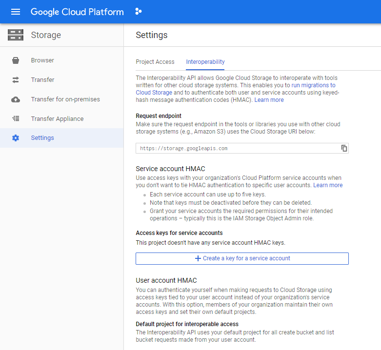
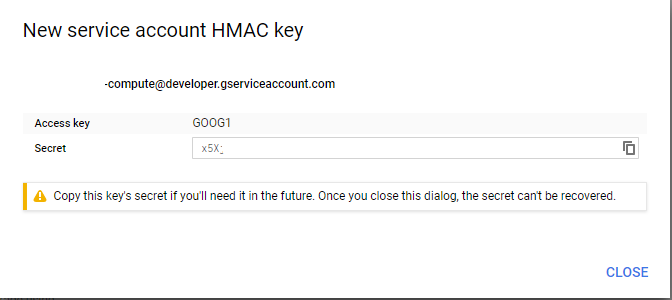

# Create a Google Storage Update in NodeJs with AWS S3

Proof of Concept for use [AWS S3 for Nodejs](https://docs.aws.amazon.com/sdk-for-javascript/v2/developer-guide/s3-example-creating-buckets.html) to connect to [Google Storage](https://cloud.google.com/storage) using using [Cloud Storage HMAC keys](https://cloud.google.com/storage/docs/authentication/hmackeys)

Prerequisites is to have a [Billing Account](https://cloud.google.com/billing/docs/how-to/manage-billing-account) on Google Cloud Platoform

## Launch

```
npm install
```

Go to [Google Storage Setting](https://console.cloud.google.com/projectselector2/storage/settings) > Interoperability > Create a key for a service account



Generate a key id and a secret:



In alternative it is possible use gcloud command:
```
gsutil hmac create ${SERVICE_ACCOUNT}
Access ID:   GOOG1********
Secret:      x5X_*********
```

Copy the access key and the secret an put it in a file called .env:

```
GOOGLE_KEY_ID =  'GOOG1***'
GOOGLE_SECRET_KEY_ID = 'x5X_***'
BUCKET = 'PROJECTID.appspot.com'
REGION = '<REGION_OF_BUCKET>'
```

At this point launch the program:
```
npm start 
```
