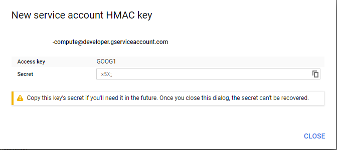

# Create a Google Storage Update in NodeJs with AWS S3

Launch:
```
npm install
```

Go to [Google Storage Setting](https://console.cloud.google.com/projectselector2/storage/settings) > Interoperability > Create a key for a service account


Generate a key id and a secret:



Copy the access key and the secret an put it in a file called .env:

```
GOOGLE_KEY_ID =  'GOOG1***'
GOOGLE_SECRET_KEY_ID = 'x5X_***'
BUCKET = 'PROJECTID.appspot.com'
REGION = '<REGION_OF_BUCKET>'
```

At this point launch the program:
```
npm start 
```
