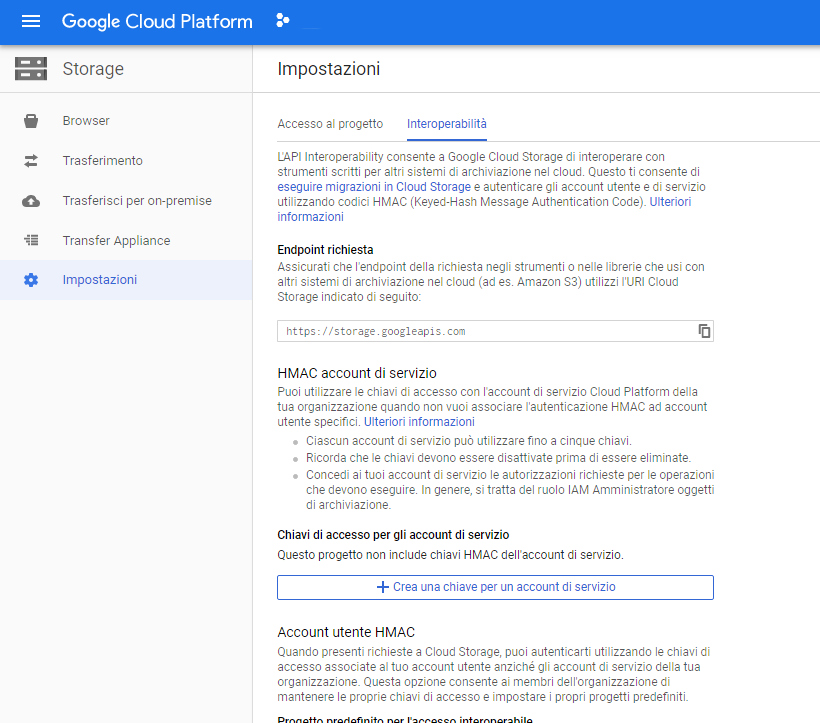
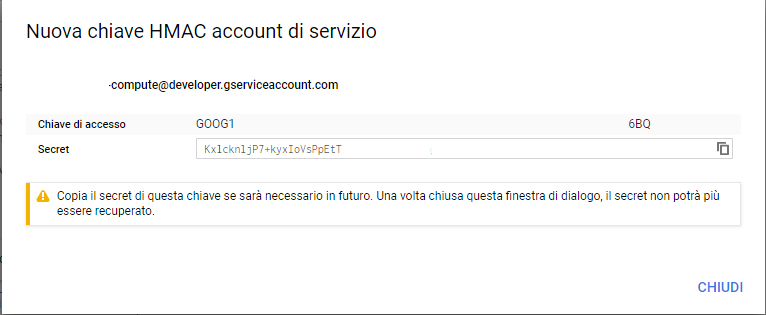

# Create a Google Storage Update in NodeJs with AWS S3

Lanciare:
```
npm install
```

Andare su [Google Storage Setting](https://console.cloud.google.com/projectselector2/storage/settings) > Crea una chiave per account di servizio



Generare una chiave id e un secret:



Copiare la Chiave di accesso e il secret e metterli in un file chiamato .env:

```
GOOGLE_KEY_ID =  'GOOG1***6BQ'
GOOGLE_SECRET_KEY_ID = 'KxlcknljP7+kyxIoVsPpEtT***'
BUCKET = 'PROJECTID.appspot.com'
REGION = '<REGION_OF_BUCKET>'
```

A questo punto lanciare il programma:
```
npm start 
```
